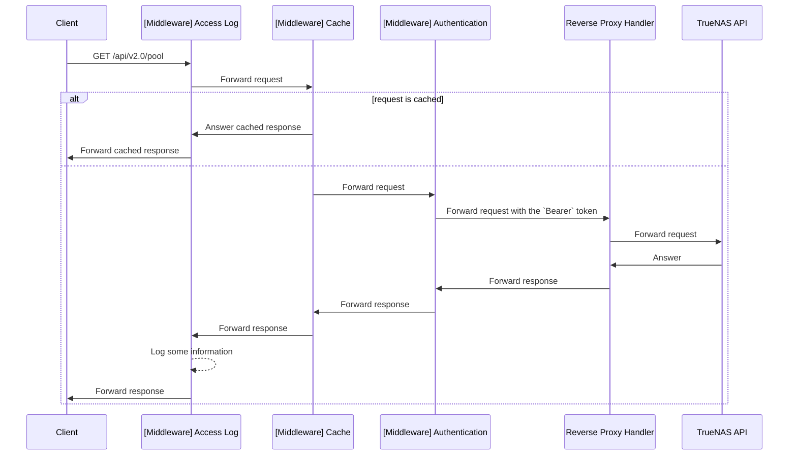

# TrueNAS reverse proxy

To have an integration between KubeApps and TrueNAS, we need to make some requests to the TrueNAS API, such as listing
the datasets. However, since TrueNAS does not provide a limited access token to the API, it is necessary to limit access
to the API to the bare minimum by other means.

This is the reason why this reverse proxy was implemented. It allows three things:
- Limit access to the API "functionally": since only a few routes have been defined, it is technically impossible to use
  other routes via this proxy.
- Avoid having an API token accessible directly from the KubeApps UI.
- Have some long queries cached

### Why not use a reverse proxy?
I had thought at first to use nginx. However, I don't need all the functionality of the latter.  
Moreover, the code of this reverse proxy is small enough (LoC < 200) that anyone, with some Go knowledge, can read it.

## Code explanation
For those who want to know what this proxy does, here is an explanation of each part, step by step:

> _NOTE:_ some part of the code are commented, so all information you need are already inside the comment.

### `HttpResponseEntry` (`proxy.go`)

```go
// HttpResponseEntry is used to store the cached response
// inside the LRU cache.
type HttpResponseEntry struct {
    Header http.Header
    Body   []byte
    
    // created is used to know when this entry has been created
    created time.Time
}
```

### `const` about the internal cache mechanism (`proxy.go`)

```go
const (
	// CacheMaxAge is the time to wait before expiring a cached response
	// NOTE: 2min seems to be a good option for the cache age; it allows fast refresh
	// 	     on the UI and, if someone update something on TrueNAS, it will be updated
	//	     in the next 2min.
	CacheMaxAge = 2 * time.Minute
	// CacheSize is the size of the LRU cache
	// NOTE: 10Mi seems to be a good value; on large response, I reach ~500ko maximum for a
	//	     response. With this size, we can store around 20 big entries without issues.
	CacheSize = 10 * 1024 * 1024 * 1024
)
```

### Setup of `go.uber.org/zap` (`main.go`)

```go
	log, _ := zap.NewProduction(zap.ErrorOutput(os.Stderr))
	if env, exists := os.LookupEnv("LOG_LEVEL"); exists {
		if level, err := zap.ParseAtomicLevel(env); err != nil {
			log.Error(err.Error())
		} else {
			log, _ = zap.NewProduction(zap.IncreaseLevel(level))
		}
	}
	defer log.Sync()
```

In order to give some information in the logs about the execution of the proxy (error for example), we use the project
`go.uber.org/zap`. It is a very light logger and is perfectly adapted to our situation.  
The configuration of pretty straight forward; it logs by default all messages with a criticality equal or higher than
`info` in the standard error output (`os.Stderr`). The verbosity can be changed via the `LOG_LEVEL` environment
variable.

### Setup of `github.com/urfave/cli/v2` (`main.go`)

```go
	app := &cli.App{
		Name:  "belug-apps API proxy",
		Usage: "TrueNAS API proxy with only required paths enabled, for security reason",
		Flags: []cli.Flag{
			&cli.StringFlag{Name: "listen.addr", Usage: "Address to listen on", Value: "localhost:8080", EnvVars: []string{"LISTEN_ADDR"}},
			&cli.StringFlag{Name: "truenas.url", Usage: "TrueNAS address", Required: true, EnvVars: []string{"TRUENAS_URL"}},
			&cli.StringFlag{Name: "truenas.token", Usage: "TrueNAS API token", Required: true, EnvVars: []string{"TRUENAS_TOKEN"}},
			&cli.BoolFlag{Name: "tls.insecure", Usage: "Allow insecure server connections", Value: false, EnvVars: []string{"TLS_INSECURE"}},
		},

		Action: ProxyAction(log),
}
```

To define the CLI, I used `github.com/urfave/cli/v2` for its simplicity of use and because I didn't need something as 
complex as `spf13/cobra` for example.

In our case, 4 options are possible in our CLI:
- On which **address** the proxy listens
- The **url** and **access** token of TrueNAS
- The **activation of the `insecure` mode**, required to communicate with TrueNAS if you use a self-signed certificate

All of these flags can also be configured directly through environment variables.

### `ProxyAction`, the main part of this reverse proxy (`proxy.go`)

#### Extracting some flags values

```go
			truenasToken := ctx.String("token")
			truenasURL, err := url.Parse(ctx.String("url"))
			if err != nil {
				return err
			}
```

Here, we juste extract the TrueNAS URL and API token, with some validation.

#### Setup of the ARC cache

```go
			// NOTE: ARC cache is a simple but efficient cache for our usage
			log.Info(fmt.Sprintf("setup ARC cache (%d bytes)", CacheSize))
			cache, err := lru.NewARC(CacheSize)
			if err != nil {
				return err
			}
```

> _NOTE:_ The `CacheSize` is the `const` define at the beginning.

#### Setup of the reverse proxy handler

```go
			// NOTE: in order to have the proxy mechanism, we will use the
			//		 httputil.ReverseProxy as handler.
			log.Info(fmt.Sprintf("setup reverse proxy to %s", truenasURL.String()))
			proxy := httputil.NewSingleHostReverseProxy(truenasURL)
			proxy.Transport = http.DefaultTransport
			if ctx.Bool("insecure") {
				log.Warn("insecure mode enabled; all communication between TrueNAS and API will not be encrypted")
				proxy.Transport.(*http.Transport).TLSClientConfig = &tls.Config{InsecureSkipVerify: true}
			}
```

The standard golang library provides a tool to easily create a reverse proxy handler, which is then used by the 
HTTP server.  
This is also where we disable TrueNAS TLS certificate verification, if you enable the insecure mode.

#### Setup of `github.com/gorilla/mux`

```go
			// NOTE: we will use a router to easily handle auth and cache middleware and
			//		 to only handle route that we need for Belug-Apps
			r := mux.NewRouter()
			r.NotFoundHandler = http.HandlerFunc(func(w http.ResponseWriter, _ *http.Request) { w.WriteHeader(http.StatusUnauthorized) })
			r.MethodNotAllowedHandler = r.NotFoundHandler
```

The choice of `github.com/gorilla/mux` is personal, as I like this library and have used it before.  
I also chose to answer `401` on all paths except the mandatory ones instead of answering `404`. I thought that in our 
case it made more sense.

#### Middlewares

The main part of this proxy lies in the use of middleware. These are components that will modify HTTP requests and 
responses before and after reaching the reverse proxy handler.

Here is the sequence diagram of these middlewares:


##### Logging middleware

```go
			r.Use(func(handler http.Handler) http.Handler { return handlers.CombinedLoggingHandler(os.Stdout, handler) })
```

In order to have easily parsable access logs, I use a handler already provided by `github.com/gorilla`. All access logs 
are written on the standard output.

##### Cache middleware

This is the most complex part of the reverse proxy. This cache is based on two algorithms:
- [Adaptive Replacement Cache](https://en.wikipedia.org/wiki/Adaptive_replacement_cache) (ARC), a variant of LRU for the cache policy
- [Fowler-Noll-Vo](https://en.wikipedia.org/wiki/Fowler%E2%80%93Noll%E2%80%93Vo_hash_function) (FNV) for the key hashing

The choice of these two algorithms is mainly due to the fact that they are two performant algorithms that I knew about.

###### Preparation

```go
					begin := time.Now()
					hash := fnv.New128a()
```

The first step is to prepare some variables that will be useful later on:
- The start date of the execution, to know how long it took to answer a request and whether it should be cached.
- Instantiating the hash tool

###### Generate the cache key

```go
					_, _ = hash.Write([]byte(req.URL.String()))

					// NOTE: on POST request, we would like to use the body as key cache
					if req.Method == http.MethodPost {
						bodyBytes, _ := io.ReadAll(req.Body)
						_ = req.Body.Close()
						req.Body = io.NopCloser(bytes.NewReader(bodyBytes))
						_, _ = hash.Write(bodyBytes)
					}
					key := string(hash.Sum(nil))
```

The cache key is based on two elements:
- the URL
- the body content in the case of a POST; we only want to cache if the request is essentially the same. I know it's not
  a good practice to cache POST requests. However, in our context, the only POST request we need to cache is the one 
  where we want to get the folder list.

###### Fetch the cache with the cache key

```go
					// NOTE: fetch and check if the request is already cached
					cached, exists := cache.Get(key)
					switch {
					case exists && begin.Sub(cached.(*HttpResponseEntry).created) >= CacheMaxAge:
						cache.Remove(key)
					case exists:
						_, _ = w.Write(cached.(*HttpResponseEntry).Body)
						for k, vs := range cached.(*HttpResponseEntry).Header {
							for _, v := range vs {
								w.Header().Add(k, v)
							}
						}
						return
					}
```

We search the cache to see if the request was properly cached. If it was and if its age does not exceed the defined 
value `CacheMaxAge`, we return the response immediately. If it is expired, we simply remove it from the cache.

> **WARN**: This proxy does not respect the HTTP standard regarding cache management. It does not take into account the
>           HTTP headers, and does not fill them. So, it is impossible on the client side to know if the response has
>           been cached or not.

###### Prepare the response recorder and send the request

```go
					recorder := httptest.NewRecorder()
					handler.ServeHTTP(recorder, req)
```

In order to be able to intercept the response of the next middleware/handler, we use a tool generally used for tests; 
`httptest.Recorder`. It will allow us to retrieve the data from the response.

###### Cache the response

```go
					// NOTE: we cache responses only TrueNAS respond in more than 500ms
					if recorder.Code == http.StatusOK && time.Now().Sub(begin) > 500*time.Millisecond {
						cache.Add(key, &HttpResponseEntry{
							Header:  recorder.Header(),
							Body:    recorder.Body.Bytes(),
							created: time.Now()},
						)
					}
```

If the response is valid (`200`) and if the response time is greater than 500ms, we hide the response.  
The choice of 500ms is purely arbitrary. Below that, I don't feel the difference, and we fill in the cache for nothing.

```go
					// NOTE: we copy all data from the recorder to the response
					w.WriteHeader(recorder.Code)
					_, _ = w.Write(recorder.Body.Bytes())
					for k, vs := range recorder.Header() {
						for _, v := range vs {
							w.Header().Add(k, v)
						}
					}
				})
```

This last part simply moves the data from the recorder to the answer writer.

#### Authentication middleware

```go
			r.Use(func(handler http.Handler) http.Handler {
				// NOTE: authentication middleware
				return http.HandlerFunc(func(w http.ResponseWriter, req *http.Request) {
					req.Header.Set("Authorization", "Bearer "+truenasToken)
					handler.ServeHTTP(w, req)
				})
			})
```

This middleware adds the TrueNAS API token in the `Authorization` header as a Bearer token.

### Route definition (`proxy.go`)

```go
			// NOTE: here is where all required paths are allowed
			r.Methods(http.MethodGet).
				Path("/api-proxy/v2.0/pool").
				HandlerFunc(proxy.ServeHTTP)
			r.Methods(http.MethodGet).
				Path("/api-proxy/v2.0/pool/dataset").
				HandlerFunc(proxy.ServeHTTP)
			r.Methods(http.MethodPost).
				Path("/api-proxy/v2.0/filesystem/listdir").
				HandlerFunc(proxy.ServeHTTP)
```

### Start the internal HTTP server (`proxy.go`)

```go
			log.Info(fmt.Sprintf("start API on %s", ctx.String("listen")))
			return http.ListenAndServe(ctx.String("listen"), r)
```

### Start the proxy (`main.go`)

```go
	if err := app.Run(os.Args); err != nil {
		log.Fatal(err.Error())
		os.Exit(1)
	}
```
